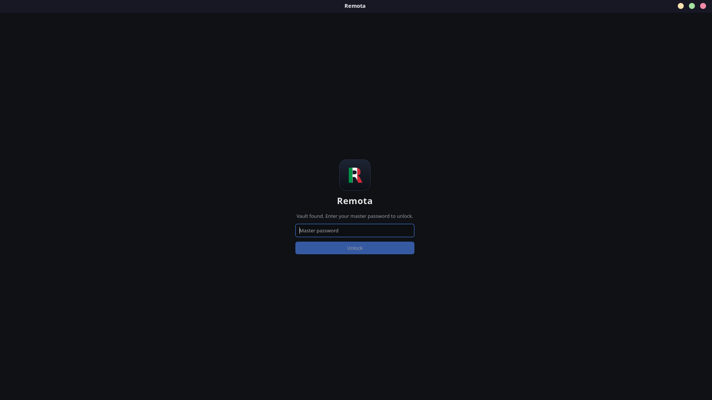
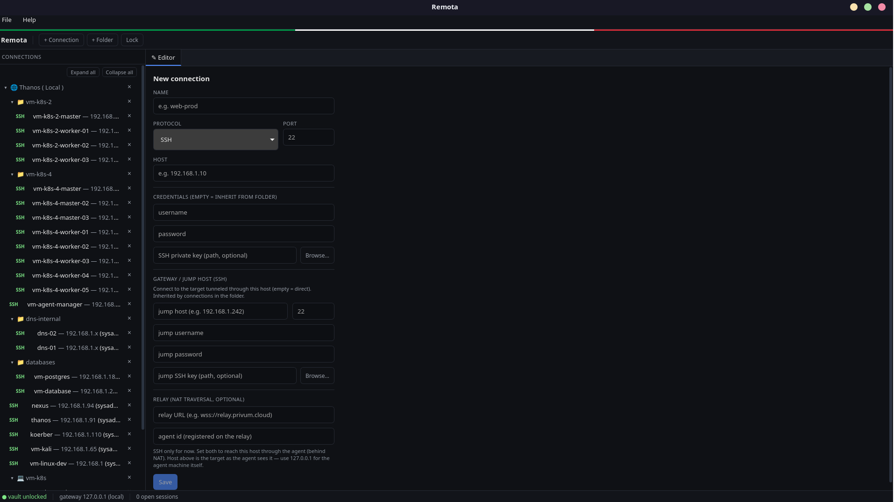
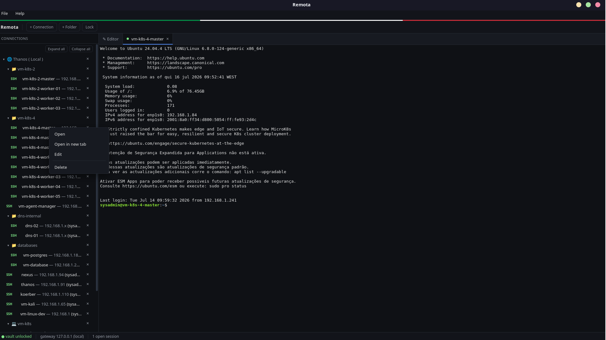
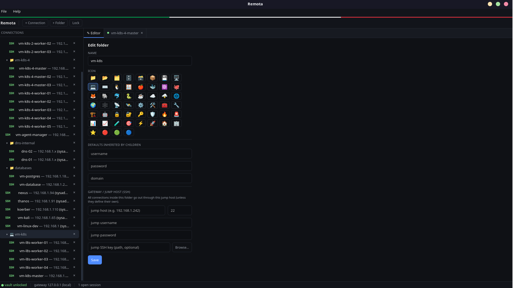

<div align="center">


# Remota

**Open-source remote connection manager for Linux — SSH, RDP, VNC and Telnet in one fast, organized, encrypted app.**

A free, self-hosted alternative to mRemoteNG (built for Linux) and to cloud remote‑access tools — keep all your servers, PCs and devices in one place, with no third‑party cloud.

[](./LICENSE)


Made with ❤️ in Italy by **[Privum Cloud »](https://privum.cloud)**

</div>

---

Remota is a native Linux desktop app to **manage and open remote sessions** across many
protocols from a single window. Organize hundreds of hosts into folders, inherit credentials,
tunnel through jump hosts, and reach machines behind NAT through **your own relay** — all
protected by a local encrypted vault. It's for developers, sysadmins, homelabbers, IT teams,
students — anyone who connects to more than one remote machine.

> 🆕 **New — full RDP support.** Connect to Windows over **RDP with NLA/CredSSP**: screen,
> keyboard & mouse, clipboard, and dynamic resolution. Grab the [latest release](../../releases/latest).

## Why Remota

[mRemoteNG](https://mremoteng.org/) is a much-loved multi-protocol connection manager — but it
is **Windows-only**, and there is no official Linux version. Remota was born to fill that gap:
to bring the same tabbed, folder-organized, multi-protocol workflow to **Linux**, as a fast
native app that is **fully open source**. If you've been searching for *"mRemoteNG for Linux"*
or a *"Linux remote connection manager"*, that's exactly what Remota is — plus an encrypted
vault and self-hosted access to machines behind NAT.

## Screenshots

| Encrypted vault | Organize & configure |
|---|---|
|  |  |
| **Live SSH terminal** | **Folders with icons** |
|  |  |

## Features

- **Multi-protocol** — SSH and **RDP** (with NLA/CredSSP) in tabs today; VNC and Telnet on the way.
- **Organized** — folders and subfolders; drag-and-drop; expand/collapse; custom icons.
- **Credential inheritance** — set a username / password / SSH key / jump host on a folder and
  every connection inside inherits it (override per host).
- **Encrypted vault** — your connections and secrets are stored locally, encrypted with
  **AES-256-GCM + Argon2id**, unlocked by a master password. Nothing leaves your machine.
- **Jump hosts (SSH ProxyJump)** — reach private hosts through a bastion, per host or per folder.
- **Reach machines behind NAT** — run a small agent on a remote machine and connect to it through
  your **self-hosted relay** — a private alternative to AnyDesk / remote.it / RustDesk, no cloud.
- **SSH keys** — password or private-key auth, including on the jump host.
- **Import** — bring your existing setup in from **mRemoteNG** (`confCons.xml`) or Remota JSON.
- **Real terminal** — xterm.js with a properly-sized PTY, so `vim`, `k9s`, `htop` fill the pane
  and follow window resizes.
- **Recycle bin** — deleting moves items to a Trash you can restore from.
- **Native & fast** — a small Rust/Tauri binary, not a bundled browser.

## Install

Remota runs on Linux (x86_64). Pick your format:

Download the latest package from the **[Releases](../../releases/latest)** page:

### Debian / Ubuntu (`.deb`)

```bash
sudo apt install ./Remota_*_amd64.deb
```

### Fedora / RHEL / openSUSE (`.rpm`)

```bash
sudo dnf install ./Remota-*.x86_64.rpm
```

### Any Linux (`.AppImage`)

Portable — no install:

```bash
chmod +x Remota_*.AppImage
./Remota_*.AppImage
```

### Build from source

Requires [Rust](https://rustup.rs), Node.js 18+, and the
[Tauri Linux prerequisites](https://tauri.app/start/prerequisites/) (WebKitGTK, etc.).

```bash
git clone https://github.com/privum-cloud/remota.git
cd remota
npm install
npm run tauri build          # bundles land in src-tauri/target/release/bundle/
# or run it live during development:
npm run tauri dev
```

First launch asks you to set a **master password** — it encrypts your vault. Then add a
connection (or import from mRemoteNG) and double-click to open a session.

## Reach machines behind NAT (self-hosted)

Remota can reach a machine on any network — behind NAT, no public IP, no open ports — by running
a tiny **agent** on it that dials out to a **relay** you host. The operator connects to the
device through the relay from the app. See **[remota-client](https://github.com/privum-cloud/remota-client)**
for the agent and installer.

## Architecture

- **Desktop app** — [Tauri](https://tauri.app) v2 (Rust) + React + TypeScript.
- **Local gateway** — a WebSocket bridge bound to `127.0.0.1` with single-use per-session tokens:
  a raw `WS↔TCP` bridge for VNC/Telnet, native SSH via `russh`, and an RDCleanPath proxy for RDP.
- **Renderers** — xterm.js (SSH/Telnet), noVNC (VNC), IronRDP `ironrdp-web`/WASM (RDP).
- **Vault** — portable encrypted file (AES-256-GCM + Argon2id).
- **Relay & agent** — Rust, WSS, outbound-only from the agent; TLS terminated at a reverse proxy.

## Contributing & feedback

Remota is young and moving fast, and **your feedback shapes it** — please don't hesitate to speak up:

- 🐛 **Found a bug, or something doesn't work?**
  [**Open an issue**](https://github.com/privum-cloud/remota/issues/new) — reports get acted on
  quickly (RDP support in this release came straight from
  [#2](https://github.com/privum-cloud/remota/issues/2)).
- 💡 **Want a feature or another protocol?** Open an issue and tell us what you need.
- 🔧 **Code?** Pull requests are welcome. Remota is **clean-room** — please don't paste code from
  other remote-connection managers.

Browse existing issues first: **[github.com/privum-cloud/remota/issues](https://github.com/privum-cloud/remota/issues)**.

## License

Licensed under the **GNU Affero General Public License v3.0** — see [`LICENSE`](./LICENSE).

## Attribution

Remota is an independent, clean-room project inspired by the workflow of
[mRemoteNG](https://mremoteng.org/). It shares no code with mRemoteNG.

---

<div align="center">

Built and maintained by **[Privum Cloud](https://privum.cloud)** — Kubernetes, DevSecOps & 24/7 SRE.

</div>
